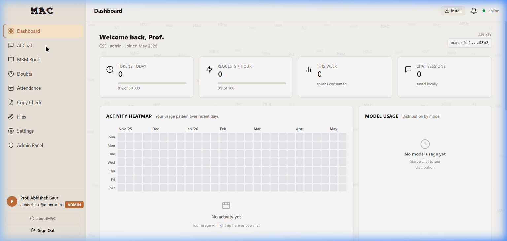
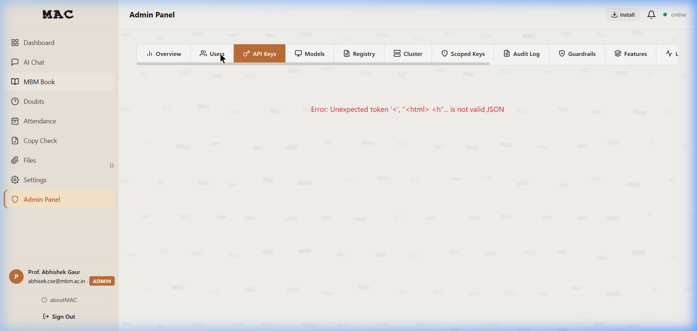
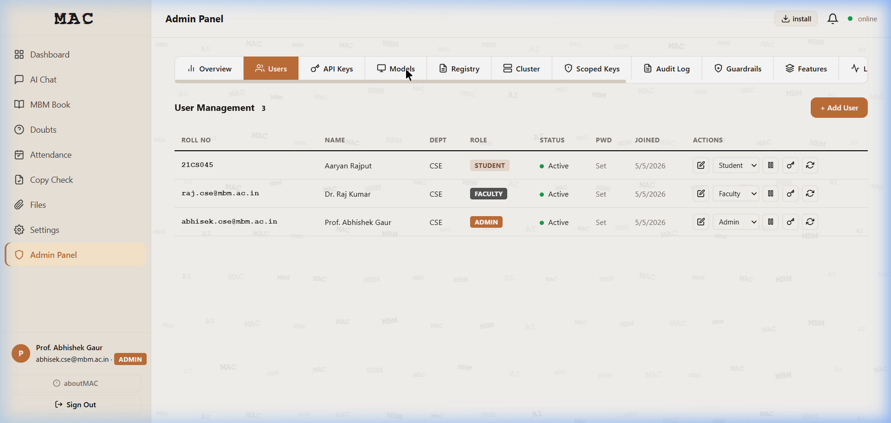

.. _admin-guide:

===================
Administrator Guide
===================

Administrators have full control over the MAC platform, including user management,
feature configuration, cluster management, and system settings.

Admin Dashboard
===============

   *The Admin Dashboard showing usage statistics, activity heatmap, model usage
   distribution, and the full sidebar navigation with all admin tools.*

The admin sidebar includes all features available to students and faculty, plus:

- **Admin Panel** -- Central management hub
- **Hardware** -- GPU/CPU/RAM monitoring
- **Cluster** -- Worker node management
- **Network** -- Speed tests and network info
- **Academic** -- Branch and section management
- **Usage** -- Platform-wide usage analytics

Admin Panel
===========

The Admin Panel is the central management hub with multiple tabs:

   *The Admin Panel showing the tab navigation: Overview, Users, API Keys, Models,
   Registry, Cluster, Scoped Keys, Audit Log, Guardrails, Features, and more.*

User Management
---------------

   *The User Management tab showing all registered users with their Roll Number,
   Name, Department, Role, Status, Password state, Join date, and action buttons.*

**Available Actions:**

.. list-table::
   :header-rows: 1
   :widths: 20 80

   * - Action
     - Description
   * - **Edit**
     - Modify user details (name, email, department)
   * - **Delete**
     - Remove a user account
   * - **Reset Password**
     - Force password reset on next login
   * - **Change Role**
     - Promote or demote a user (Student/Faculty/Admin dropdown)
   * - **Toggle Status**
     - Activate or deactivate a user account

**Adding a New User:**

1. Click **"+ Add User"** in the top-right corner
2. Fill in the user details form
3. The user will be created with ``must_change_password=True``

Registry Management
-------------------

The Registry is used to pre-register students, faculty, and admins before they
sign up. It contains their Registration Number, Name, Department, Date of Birth,
and Role.

**Adding Registry Entries:**

- **Single entry:** Click "Add" and fill in the form
- **Bulk import:** Upload a JSON or CSV file with multiple entries
- **CSV format:** ``roll_number,name,department,dob,batch_year,role``

**Registry Tabs:**

The Registry is organized into three sub-tabs:

1. **Students** -- All student registry entries
2. **Faculty** -- All faculty registry entries
3. **Admins** -- All admin registry entries

Feature Flags
-------------

Feature flags control which features are available to which roles:

.. list-table:: Default Feature Flags
   :header-rows: 1
   :widths: 20 25 55

   * - Flag Key
     - Label
     - Default Enabled Roles
   * - ``ai_chat``
     - AI Chat
     - Student, Faculty, Admin
   * - ``web_search``
     - Web Search in Chat
     - Student, Faculty, Admin
   * - ``mbm_book``
     - MBM Book (Notebooks)
     - Student, Faculty, Admin
   * - ``rag_upload``
     - Document Upload
     - Student, Faculty, Admin
   * - ``doubts_forum``
     - Doubts Forum
     - Student, Faculty, Admin
   * - ``file_sharing``
     - File Sharing
     - Student, Faculty, Admin
   * - ``voice_input``
     - Voice Input (STT)
     - Student, Faculty, Admin
   * - ``tts_output``
     - Text-to-Speech
     - Student, Faculty, Admin
   * - ``image_gen``
     - Image Generation
     - Student, Faculty, Admin
   * - ``community_models``
     - Community Models
     - Student, Faculty, Admin
   * - ``dark_mode``
     - Dark Mode
     - Student, Faculty, Admin
   * - ``guest_access``
     - Guest Access
     - *(disabled)*
   * - ``video_studio``
     - Video Studio
     - Admin only

Quota Management
----------------

Admins can set per-user quotas for API usage:

- **Requests per hour** -- Default: 100
- **Tokens per day** -- Default: 50,000
- **Storage quota** -- Per-user file storage limit (in MB)

Quotas can be overridden for individual users from the Quota tab.

Guardrails
----------

Content safety rules that are checked before sending prompts to the LLM.
Admins can add, edit, or remove guardrail rules that filter inappropriate content.

Audit Log
---------

The Audit Log records all administrative actions:

- User creation, modification, and deletion
- Role changes
- Feature flag modifications
- System configuration changes

Cluster Management
==================

MAC supports a multi-PC GPU cluster where additional machines contribute
processing power:

**Cluster Architecture:**

.. code-block:: text

   PC1 (Host)    -- start-mac.bat       -- All services + Qwen2.5-7B chat
   PC2 (Worker)  -- start-mac-worker.bat -- Mistral-7B creative chat
   PC3 (Worker)  -- start-mac-worker.bat -- Qwen2-VL-7B vision model

**Adding a Worker Node:**

1. Install MAC on the worker machine
2. Run ``start-mac-worker.bat``
3. The worker auto-registers with the host
4. Monitor connected workers from the **Cluster** tab in the Admin Panel

**Worker nodes provide:**

- Additional GPU inference capacity
- Load-balanced request distribution
- Heartbeat monitoring for reliability

Hardware Monitoring
===================

The Hardware page shows real-time system metrics:

- **GPU utilisation** -- Memory usage, temperature, compute load
- **CPU utilisation** -- Per-core usage
- **RAM usage** -- Total, used, and available memory
- **Disk usage** -- Storage capacity and utilisation

Network Tools
=============

The Network page provides:

- **Speed test** -- Measure network throughput
- **Network info** -- Display LAN IP addresses and interface details
- **QR Wi-Fi join** -- Generate QR codes for easy Wi-Fi connection

Academic Structure
==================

Manage the institution's academic structure:

- **Branches** -- Create and manage academic branches (e.g., CSE, ECE, ME)
- **Sections** -- Define sections within each branch
- **Year assignment** -- Assign students to year groups

System Configuration
====================

The System tab provides key-value configuration for platform-wide settings.
These are stored in the ``system_config`` database table and can be modified
at runtime without restarting the application.

First-Boot Setup
================

When deploying MAC for the first time:

1. Navigate to ``http://<server-ip>/``
2. The setup wizard appears automatically (if no users exist)
3. Create the **founder admin account**:

   - Enter name, email, and password
   - This account gets ``is_founder=True`` for recovery purposes

4. Log in with the founder account
5. Navigate to **Admin Panel > Registry**
6. Bulk-import the student and faculty registry
7. Students and faculty can now verify and create their accounts
