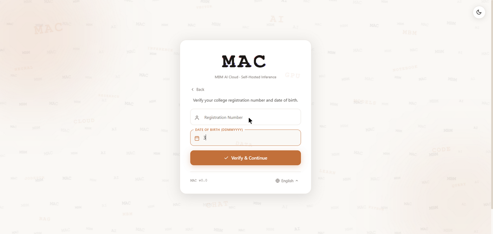
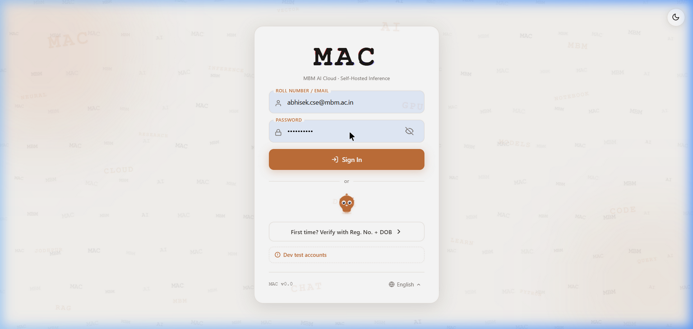

.. _authentication:

==============
Authentication
==============

MAC uses a role-based authentication system with JWT tokens, bcrypt password hashing,
and a student/faculty registry for secure account provisioning.

User Roles
==========

MAC supports three roles, each with distinct access levels:

.. list-table:: Role Permissions Matrix
   :header-rows: 1
   :widths: 20 15 15 15 35

   * - Feature
     - Student
     - Faculty
     - Admin
     - Notes
   * - AI Chat
     - |yes|
     - |yes|
     - |yes|
     - Multi-session, streaming, web search
   * - MBM Book (Notebooks)
     - |yes|
     - |yes|
     - |yes|
     - 25+ language kernels
   * - RAG (Document Chat)
     - |yes|
     - |yes|
     - |yes|
     - Upload PDF/DOCX/TXT
   * - Doubts Forum
     - |yes|
     - |yes|
     - |yes|
     - Post and answer questions
   * - File Sharing
     - |yes|
     - |yes|
     - |yes|
     - Download shared files
   * - Voice Chat (STT + TTS)
     - |yes|
     - |yes|
     - |yes|
     - Whisper STT + Veena TTS
   * - Admin Panel
     - |no|
     - |no|
     - |yes|
     - User CRUD, quotas, feature flags
   * - Cluster Management
     - |no|
     - |no|
     - |yes|
     - Worker node management

.. |yes| unicode:: U+2705
.. |no| unicode:: U+274C

Account Verification (First-Time Sign-Up)
==========================================

New users must verify their identity using their **Registration Number** and
**Date of Birth** before they can create an account.

   *The verification page where new users enter their Registration Number and Date of Birth.*

**Verification Flow:**

1. Navigate to the MAC login page at ``http://<server-ip>/``
2. Click **"First time? Verify with Reg. No. + DOB"**
3. Enter your Registration Number (e.g., ``21CS045`` for students)
4. Enter your Date of Birth in ``DDMMYYYY`` format (e.g., ``15082003``)
5. Click **"Verify & Continue"**
6. If verification succeeds, your account is created with a temporary password
7. You will be prompted to set a new password on first login

.. list-table:: DOB Verification Examples
   :header-rows: 1

   * - Role
     - Registration No.
     - DOB (DDMMYYYY)
   * - Admin
     - ``abhisek.cse@mbm.ac.in``
     - ``01011990``
   * - Faculty
     - ``raj.cse@mbm.ac.in``
     - ``15061985``
   * - Student
     - ``21CS045``
     - ``15082003``

Login Process
=============

   *The MAC login page with the animated background, multi-language selector, and Sign In form.*

**To log in:**

1. Open your browser and navigate to ``http://<server-ip>/``
2. Enter your **Roll Number / Email** in the first field
3. Enter your **Password** in the second field
4. Click the **"Sign In"** button
5. On successful login, you will be redirected to the Dashboard

.. tip::

   Use the **language selector** at the bottom of the login page to switch between
   19 supported languages including English, Hindi, Rajasthani, Gujarati, and Urdu.

Multi-Language Support
======================

MAC supports **19 languages** for the user interface. The language can be changed
from the login page using the language picker at the bottom:

- English, Hindi, Rajasthani, Gujarati, Urdu
- Bengali, Tamil, Telugu, Kannada, Malayalam
- Marathi, Punjabi, Odia, Assamese
- Sanskrit, Nepali, Sindhi, Maithili, Bodo

Password Security
=================

MAC enforces the following password security measures:

- **bcrypt hashing** -- All passwords are hashed using bcrypt before storage
- **Forced password change** -- New accounts have ``must_change_password=True``
- **Account lockout** -- After repeated failed login attempts, the account is locked
- **JWT tokens** -- 24-hour access tokens with 30-day refresh tokens
- **Token blacklisting** -- Tokens are invalidated on logout via Redis

API Key Authentication
======================

For programmatic access, MAC supports API key authentication:

.. code-block:: bash

   curl -H "Authorization: Bearer mac_sk_live_<your-key>" \
       http://<server-ip>/api/query/chat \
       -d '{"messages": [{"role": "user", "content": "Hello"}]}'

API keys can be managed from the **Dashboard** (visible in the top-right corner)
or from the Admin Panel under the **API Keys** tab.
