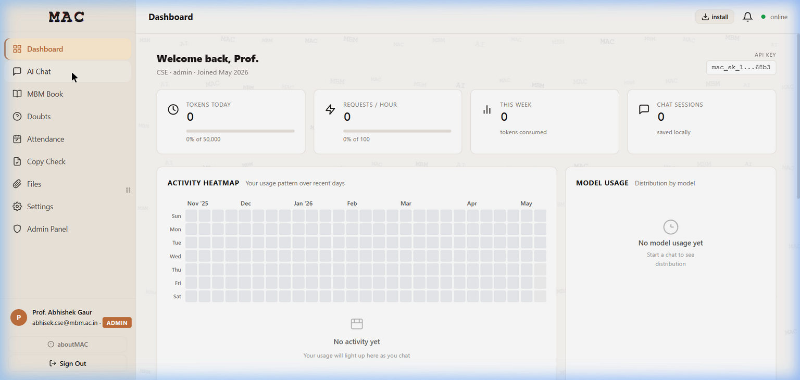
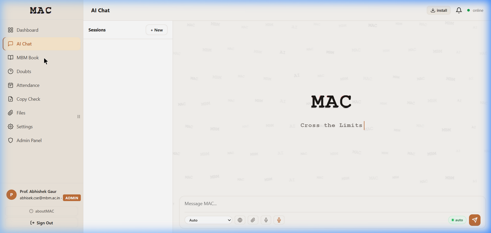

.. _features:

=================
Platform Features
=================

MAC provides a comprehensive suite of AI-powered tools and academic utilities.
This section provides an overview of every feature available on the platform.

.. _feature-ai-chat:

AI Chat
=======

The AI Chat is the primary interface for interacting with locally-hosted large
language models. It supports multi-turn conversations with streaming responses.

   *The AI Chat interface showing session management, model selector, and message input
   with web search, file attachment, and voice input options.*

**Key Capabilities:**

- **Multi-session management** -- Create, rename, and switch between chat sessions
- **Streaming responses** -- Responses appear in real-time as the model generates them
- **Web search integration** -- Toggle web search to ground responses with live data via SearXNG
- **File attachment** -- Upload documents (PDF, DOCX, TXT) for context-aware responses
- **Voice input** -- Click the microphone icon for speech-to-text via Whisper
- **Text-to-speech** -- Listen to responses using the Veena TTS engine
- **Model selection** -- Choose between available models (Auto, Qwen2.5, Mistral, etc.)
- **Code highlighting** -- Code blocks are syntax-highlighted with copy buttons
- **Markdown rendering** -- Full Markdown support with Mermaid diagram rendering

**How to Use:**

1. Click **"AI Chat"** in the sidebar
2. Click **"+ New"** to start a new conversation session
3. Type your message in the **"Message MAC..."** input field
4. Toggle the globe icon for web search, or attach files with the paperclip icon
5. Press Enter or click the send button to submit

.. _feature-mbm-book:

MBM Book (Cloud IDE & Notebooks)
=================================

MBM Book is a full-featured cloud IDE with a VS Code-powered Monaco editor.
Each user gets their own isolated Docker container with multiple language runtimes.

   *The MBM Book IDE with the MAC branding, session panel, and code editor area
   displaying the "Cross the Limits" tagline.*

**Features:**

- **Monaco Editor** -- VS Code's editing engine with syntax highlighting, IntelliSense,
  and multi-tab support
- **25+ language kernels** -- Python, JavaScript, TypeScript, R, Julia, Ruby, PHP, C,
  C++, Java, Go, Rust, C#, Kotlin, Scala, Swift, Bash, SQL, Lua, MATLAB/Octave,
  Haskell, Perl, Zig, HTML, and Markdown
- **Integrated terminal** -- Full PTY terminal with ANSI colour support
- **Resizable panels** -- Drag to resize file explorer, editor, and terminal
- **Fullscreen cells** -- Expand any code cell to fullscreen for focused editing
- **Live Markdown preview** -- Split-pane editing for Markdown cells with live preview

**Keyboard Shortcuts:**

.. list-table::
   :header-rows: 1

   * - Shortcut
     - Action
   * - ``Shift+Enter``
     - Execute current cell
   * - ``Escape``
     - Blur/exit editor focus
   * - ``Ctrl+S``
     - Save notebook
   * - Fullscreen button
     - Toggle fullscreen for a cell

.. _feature-rag:

RAG (Document-Aware AI Chat)
=============================

RAG (Retrieval-Augmented Generation) allows you to upload documents and have AI
conversations grounded in their content.

**How It Works:**

1. Upload PDF, DOCX, or TXT files to a RAG collection
2. Documents are automatically chunked and embedded into the Qdrant vector database
3. When you chat, relevant document chunks are retrieved and provided as context
4. The AI generates responses informed by your documents

**Supported File Formats:**

- PDF (``.pdf``)
- Microsoft Word (``.docx``)
- Plain text (``.txt``)

.. _feature-doubts:

Doubts Forum (Q&A)
==================

The Doubts Forum is a student Q&A platform where students can post questions
and receive answers from peers and faculty.

**Features:**

- Post questions with tags and descriptions
- Answer questions with upvoting
- Faculty can provide authoritative answers
- Search and filter questions by topic

.. _feature-file-sharing:

File Sharing
============

Faculty and administrators can upload files for students to download.

**Features:**

- Upload files with descriptions and metadata
- Students can browse and download shared files
- Supports all common file formats
- File size quotas managed by the admin

.. _feature-voice:

Voice Chat (STT + TTS)
========================

MAC supports voice interaction through:

- **Speech-to-Text (STT)** -- Powered by ``faster-whisper`` (CPU-based)
- **Text-to-Speech (TTS)** -- Powered by Piper TTS via ``openedai-speech``

Click the microphone icon in the AI Chat input area to start voice input.
The platform transcribes your speech and sends it as a text message.

.. _feature-i18n:

Multilingual Interface
======================

The entire MAC interface supports **19 languages**:

.. hlist::
   :columns: 3

   * English
   * Hindi
   * Rajasthani
   * Gujarati
   * Urdu
   * Bengali
   * Tamil
   * Telugu
   * Kannada
   * Malayalam
   * Marathi
   * Punjabi
   * Odia
   * Assamese
   * Sanskrit
   * Nepali
   * Sindhi
   * Maithili
   * Bodo

.. _feature-themes:

Theme System
============

MAC supports three visual themes:

- **Warm** (default) -- Warm white background with amber accents
- **Dark** -- Full dark mode for low-light environments
- **Light** -- Pure white theme

Themes can be changed from **Settings** in the sidebar. The selected theme persists
across sessions via ``localStorage``.

.. _feature-pwa:

Progressive Web App (PWA)
=========================

MAC can be installed as a Progressive Web App on any device:

1. Click the **"Install"** button in the top navigation bar
2. Follow your browser's installation prompt
3. MAC will appear as a standalone application on your device

The PWA works offline for previously loaded pages thanks to the service worker.
