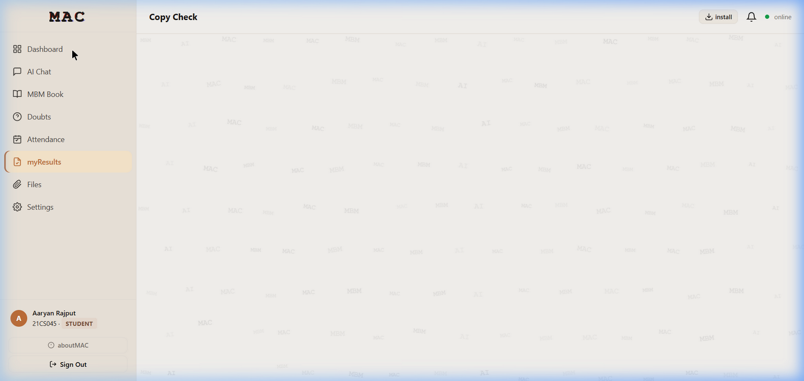

.. _student-guide:

=============
Student Guide
=============

This guide walks students through every feature available on the MAC platform.

   *The student view showing the sidebar navigation with Dashboard, AI Chat,
   MBM Book, Doubts, myResults, Files, and Settings.*

Logging In
==========

**First-Time Login (Account Verification):**

1. Open ``http://<server-ip>/`` in your browser
2. Click **"First time? Verify with Reg. No. + DOB"**
3. Enter your **Registration Number** (e.g., ``21CS045``)
4. Enter your **Date of Birth** in ``DDMMYYYY`` format (e.g., ``15082003``)
5. Click **"Verify & Continue"**
6. Set your password when prompted

**Returning Login:**

1. Enter your Roll Number in the **"Roll Number / Email"** field
2. Enter your password
3. Click **"Sign In"**

Dashboard
=========

After logging in, the Dashboard provides an overview of your platform usage:

- **Tokens Today** -- Number of AI tokens consumed today
- **Requests / Hour** -- API requests made in the last hour
- **This Week** -- Total tokens consumed this week
- **Chat Sessions** -- Number of active chat sessions
- **Activity Heatmap** -- Visual calendar of your usage patterns
- **Model Usage** -- Distribution of which AI models you've used

Using AI Chat
=============

1. Click **"AI Chat"** in the sidebar
2. Click **"+ New"** to create a new conversation
3. Type your question or prompt in the message field
4. Use the toolbar buttons for additional features:

   - **Globe icon** -- Enable web search for grounded answers
   - **Paperclip icon** -- Attach documents for context
   - **Microphone icon** -- Use voice input
   - **Model dropdown** -- Select a specific AI model (default: Auto)

5. Press **Enter** or click the send button
6. The AI response streams in real-time with syntax-highlighted code blocks

Using MBM Book (Notebooks)
============================

MBM Book is your personal cloud coding environment.

1. Click **"MBM Book"** in the sidebar
2. Create a new notebook or open an existing one
3. Add code cells and select the programming language
4. Press **Shift+Enter** to execute a cell
5. View output directly below the cell
6. Use the fullscreen button to expand a cell for focused editing

**Supported Languages:**

Python, JavaScript, TypeScript, R, Julia, Ruby, PHP, C, C++, Java, Go, Rust,
C#, Kotlin, Scala, Swift, Bash, SQL, Lua, Octave, Haskell, Perl, and more.

Using the Doubts Forum
=======================

1. Click **"Doubts"** in the sidebar
2. Browse existing questions or click to post a new one
3. Add tags and a detailed description
4. View and upvote answers from peers and faculty

Downloading Shared Files
========================

1. Click **"Files"** in the sidebar
2. Browse files uploaded by faculty and administrators
3. Click the download button to save files to your device

Changing Settings
=================

1. Click **"Settings"** in the sidebar
2. Available settings include:

   - **Theme** -- Switch between Warm, Dark, and Light themes
   - **Language** -- Choose from 19 interface languages
   - **Sidebar position** -- Dock the sidebar to the left or right
   - **Compact mode** -- Toggle compact sidebar layout

Installing as PWA
=================

1. Click the **"Install"** button in the top-right corner of the page header
2. Follow your browser's installation prompt
3. MAC will appear as a standalone app on your desktop or home screen
4. You can use MAC offline for previously loaded content
